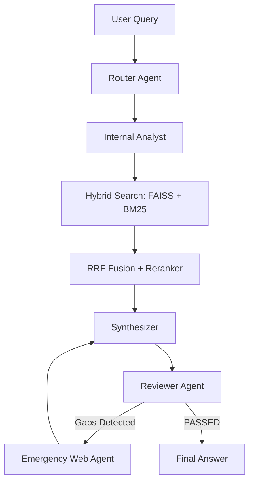
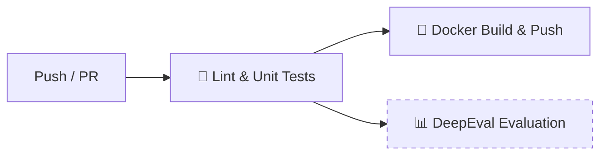

# 🤖 AI Under The Hood: Agentic Hybrid RAG Engine

A high-performance, autonomous Knowledge Engine built with **LangGraph**, **Hybrid Retrieval (FAISS + BM25)**, and **DeepEval** metrics. This system features a self-correcting multi-agent loop that triggers emergency web searches when internal data is insufficient.


---

## 🚀 Key Features

* **🔍 Hybrid Retrieval Architecture:** Combines dense semantic search (**FAISS**) with sparse keyword search (**BM25**) fused by **Reciprocal Rank Fusion (RRF)**.
* **🎯 Cross-Encoder Reranking:** Uses `ms-marco-MiniLM-L-6-v2` to mathematically rank retrieved documents, dropping anything with a relevance score below -4.0.
* **🧠 Multi-Agent Orchestration:**
  * **Router:** Extracts technical topics.
  * **Analyst:** Performs targeted internal retrieval.
  * **Synthesizer:** Crafts high-fidelity technical responses.
  * **Reviewer (The Auditor):** Evaluates responses for gaps and triggers emergency fallback loops.
* **🚑 Emergency Web Fallback:** Automatically executes a surgical **Tavily Web Search** if internal PDFs don't contain the answer.
* **📊 Industrial Evaluation:** Real-time scoring using **DeepEval** (Faithfulness, Relevance, Precision, Recall) with **Llama-3.3-70b** as the judge.

---

## 🛠️ Tech Stack

* **Framework:** LangGraph / LangChain
* **LLMs:** Groq (Llama-3.1-8b for speed, Llama-3.3-70b for evaluation)
* **Vector DB:** FAISS
* **Retrieval:** BM25 + Cross-Encoder Reranking
* **Web Search:** Tavily API
* **UI:** Streamlit (Custom Glassmorphism Design)

---

## 📦 Installation & Setup

1. **Clone the repository:**

   ```bash
   git clone https://github.com/mostafanasr300/AI-under-the-hood-RAG-sys.git
   cd AI-under-the-hood-RAG-sys
   ```

2. **Create a Virtual Environment:**

   ```bash
   python -m venv venv
   source venv/bin/activate  # On Windows: .\venv\Scripts\activate
   ```

3. **Install Dependencies:**

   ```bash
   pip install -r requirements.txt
   ```

4. **Environment Variables:**
   Create a `.env` file and add your keys:

   ```env
   GROQ_API_KEY=your_key_here
   TAVILY_API_KEY=your_key_here
   ```

---

## 🖥️ Usage

### Run the Dashboard (Recommended)

Launch the premium Streamlit interface to query your data and see the agentic journey in real-time.

```bash
streamlit run app.py
```

### Run Batch Evaluation

Execute the DeepEval test suite to measure system performance across the 7-query benchmark.

```bash
python evaluate_rag.py
```

---

## 📊 Evaluation Metrics explained

This system uses **DeepEval** to ensure zero hallucinations:

* **Faithfulness:** Measures if the answer is derived *only* from the retrieved context.
* **Contextual Recall:** Checks if the retriever found all the facts present in the ground truth.
* **Contextual Precision:** Ensures the most relevant documents are ranked at the very top.
* **Contextual Relevancy:** Judges if the retrieved snippets actually match the user's intent.

---

## 🗺️ Architecture Diagram



---

## 🔄 CI/CD Pipeline (GitHub Actions)

This project uses a **3-job automated pipeline** triggered on every push and pull request:



| Job | Trigger | Description |
|-----|---------|-------------|
| **🧪 Lint & Unit Tests** | Every push/PR | Installs deps on Python 3.12, runs `pytest` against all unit tests |
| **📊 DeepEval Evaluation** | Manual only | Runs the full 7-query RAG benchmark with Groq LLM judge |
| **🐳 Docker Build & Push** | Push to `main` | Builds multi-stage Docker image, pushes to GitHub Container Registry |

### Setting up Secrets

Go to your repo → **Settings → Secrets → Actions** and add:

| Secret | Purpose |
|--------|---------|
| `GROQ_API_KEY` | Required for LLM inference and evaluation |
| `TAVILY_API_KEY` | Required for emergency web search fallback |

### Running Tests Locally

```bash
python -m pytest tests/ -v
```

---

## 🐳 Docker Deployment

### Build & Run with Docker Compose (Recommended)

```bash
docker-compose up --build
```

Then open `http://localhost:8501` in your browser.

### Build & Run Manually

```bash
docker build -t rag-engine .
docker run -p 8501:8501 --env-file .env rag-engine
```

---

## 📁 Project Structure

```
├── .github/workflows/ci.yml   # CI/CD pipeline
├── .streamlit/config.toml     # Streamlit server config
├── Data/                      # PDF knowledge base
│   ├── ML/                    # ML papers (LoRA, DPO, GRPO, etc.)
│   └── math/                  # Math textbooks
├── tests/                     # Unit test suite
│   ├── test_utils.py          # Context parsing, schema, env tests
│   └── test_retriever.py      # RRF fusion & gating logic tests
├── main.py                    # Core RAG pipeline + LangGraph agents
├── evaluate_rag.py            # DeepEval benchmark suite
├── app.py                     # Streamlit dashboard
├── Dockerfile                 # Multi-stage container build
├── docker-compose.yml         # One-command deployment
├── requirements.txt           # Python dependencies
└── README.md
```

---
