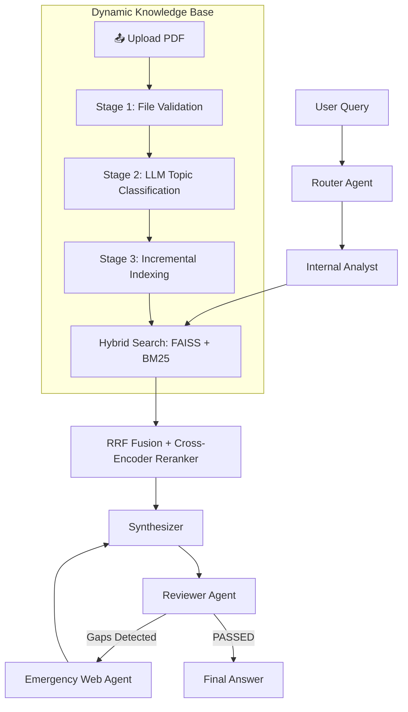
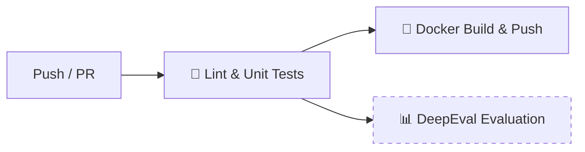

# AI Under The Hood: Agentic Hybrid RAG Engine

A high-performance, autonomous Knowledge Engine built with **LangGraph**, **Hybrid Retrieval (FAISS + BM25)**, and **DeepEval** metrics. This system features a self-correcting multi-agent loop that triggers emergency web searches when internal data is insufficient, and a **dynamic runtime upload system** that lets you expand the knowledge base without restarting the application.


---

## Key Features

* **Hybrid Retrieval Architecture:** Combines dense semantic search (**FAISS**) with sparse keyword search (**BM25**) fused by **Reciprocal Rank Fusion (RRF)**.
* **Cross-Encoder Reranking:** Uses `ms-marco-MiniLM-L-6-v2` to mathematically rank retrieved documents, dropping anything with a relevance score below -4.0.
* **Multi-Agent Orchestration:**
  * **Router:** Extracts technical topics.
  * **Analyst:** Performs targeted internal retrieval.
  * **Synthesizer:** Crafts high-fidelity technical responses.
  * **Reviewer (The Auditor):** Evaluates responses for gaps and triggers emergency fallback loops.
* **Emergency Web Fallback:** Automatically executes a surgical **Tavily Web Search** if internal PDFs don't contain the answer.
* **Industrial Evaluation:** Real-time scoring using **DeepEval** (Faithfulness, Relevance, Precision, Recall) with **Llama-3.3-70b** as the judge.
* **🆕 Dynamic Runtime Upload:** Expand the knowledge base live — upload PDFs, validate them semantically, and make them instantly retrievable, all without restarting the app.

---

## 🆕 Dynamic Knowledge Base Upload

> **The knowledge base is no longer static.** You can inject new domain-specific documents at any time while the system is running.

### How It Works

The upload pipeline consists of three sequential stages triggered from the Streamlit sidebar:

```
Upload PDF  ──►  Stage 1: File Validation  ──►  Stage 2: Topic Classification  ──►  Stage 3: Incremental Indexing
                  (format, size, dedup)           (LLM 3-way classifier)              (FAISS merge + BM25 rebuild)
```

### Stage 1 — File Validation

Before any LLM call is made, the system verifies:

| Check | Detail |
|---|---|
| Valid PDF | Magic bytes `%PDF-` must be present |
| Size limit | Maximum 50 MB |
| Readability | File must not be encrypted or corrupted |
| Extractable text | OCR-free (scanned image) PDFs are rejected |
| Filename dedup | Filename must not already exist in `Data/` |
| Content dedup | SHA-256 hash compared against all previously indexed files |

### Stage 2 — Semantic Topic Classification (3-way)

The system extracts the PDF title and the first ~1,800 characters (title, abstract, intro) and passes them to the **Groq LLM** for a 3-way classification:

| LLM Detects | User Selected | Action |
|---|---|---|
| `ML` | `ML` | ✅ Accept → saved to `Data/ML/` |
| `math` | `math` | ✅ Accept → saved to `Data/math/` |
| `ML` | `math` | ⚠️ **Redirect** → saved to `Data/ML/` + user notified |
| `math` | `ML` | ⚠️ **Redirect** → saved to `Data/math/` + user notified |
| `neither` | any | ❌ Reject — document does not belong to either domain |

**Key design choice:** A mismatch between the user's selection and the detected category is treated as a **redirect, not a rejection**. The document is still indexed — just filed under the correct category. Only documents that belong to neither domain (e.g., a cooking recipe, a legal contract) are denied.

### Stage 3 — Incremental Indexing (Zero Downtime)

Once validated, the document is processed **incrementally**:

1. **Chunked** using the same `RecursiveCharacterTextSplitter` (1,000 chars, 150 overlap) as the existing corpus.
2. **Embedded** using the already-loaded `BAAI/bge-small-en-v1.5` model (no re-download).
3. **Merged** into the existing FAISS index in-memory — existing embeddings are **never touched or rebuilt**.
4. **BM25 index** is rebuilt in-memory over all chunks (fast — no re-embedding needed).
5. **Cache persisted** to disk: updated `index.faiss`, `document_chunks.pkl`, and `file_hashes.json`.
6. **Immediately available** — the live `HybridRetriever` instance is mutated in-place, so the very next RAG query will search the new document.

### Intelligent Deduplication

Two layers prevent the same document from being indexed twice:

- **SHA-256 content hash** — detects the same file uploaded under a different name.
- **Filename check** — catches duplicate names regardless of content differences.

### Upload UI

The upload section lives in the sidebar under **"📤 Upload New Document"**:

- Two **visual category cards** (🧠 Machine Learning / 📐 Absolute Math) with an active glow highlight on selection.
- A **file uploader** restricted to `.pdf` files.
- A **step-by-step status panel** showing live progress through all 3 stages with confidence scores and reasoning.
- Clear success / warning / error messages at each stage.

---

## Tech Stack

* **Framework:** LangGraph / LangChain
* **LLMs:** Groq (Llama-3.1-8b for speed and topic classification, Llama-3.3-70b for evaluation)
* **Vector DB:** FAISS (with incremental merge support)
* **Retrieval:** BM25 + Cross-Encoder Reranking
* **PDF Parsing:** PyPDF
* **Web Search:** Tavily API
* **UI:** Streamlit (Custom Glassmorphism Design)

---

## Installation & Setup

1. **Clone the repository:**

   ```bash
   git clone https://github.com/mostafanasr300/AI-under-the-hood-RAG-sys.git
   cd AI-under-the-hood-RAG-sys
   ```

2. **Create a Virtual Environment:**

   ```bash
   python -m venv venv
   source venv/bin/activate  # On Windows: .\venv\Scripts\activate
   ```

3. **Install Dependencies:**

   ```bash
   pip install -r requirements.txt
   ```

4. **Environment Variables:**
   Create a `.env` file and add your keys:

   ```env
   grog=your_groq_key_here
   TAVILY_API_KEY=your_tavily_key_here
   ```

---

## Usage

### Run the Dashboard (Recommended)

Launch the premium Streamlit interface to query your data and see the agentic journey in real-time.

```bash
streamlit run app.py
```

### Run Batch Evaluation

Execute the DeepEval test suite to measure system performance across the 7-query benchmark.

```bash
python evaluate_rag.py
```

---

## Evaluation Metrics Explained

This system uses **DeepEval** to ensure zero hallucinations:

* **Faithfulness:** Measures if the answer is derived *only* from the retrieved context.
* **Contextual Recall:** Checks if the retriever found all the facts present in the ground truth.
* **Contextual Precision:** Ensures the most relevant documents are ranked at the very top.
* **Contextual Relevancy:** Judges if the retrieved snippets actually match the user's intent.

---

## Architecture Diagram


```mermaid
graph TD
    U[User Query] --> R[Router Agent]
    R --> A[Internal Analyst]
    A --> H["Hybrid Search: FAISS + BM25"]
    H --> RRF[RRF Fusion + Cross-Encoder Reranker]
    RRF --> S[Synthesizer]
    S --> Rev[Reviewer Agent]
    Rev -- Gaps Detected --> W[Emergency Web Agent]
    W --> S
    Rev -- PASSED --> F[Final Answer]

    subgraph "Dynamic Knowledge Base"
        UP["📤 Upload PDF"] --> V1["Stage 1: File Validation"]
        V1 --> V2["Stage 2: LLM Topic Classification"]
        V2 --> V3["Stage 3: Incremental Indexing"]
        V3 --> H
    end
```

---

## CI/CD Pipeline (GitHub Actions)

This project uses a **3-job automated pipeline** triggered on every push and pull request:


```mermaid
graph LR
    A["Push / PR"] --> B["🧪 Lint & Unit Tests"]
    B --> C["🐳 Docker Build & Push"]
    B --> D["📊 DeepEval Evaluation"]
    style D stroke-dasharray: 5 5
```

| Job | Trigger | Description |
|-----|---------|-------------|
| **Lint & Unit Tests** | Every push/PR | Installs deps on Python 3.12, runs `pytest` against all unit tests |
| **DeepEval Evaluation** | Manual only | Runs the full 7-query RAG benchmark with Groq LLM judge |
| **Docker Build & Push** | Push to `main` | Builds multi-stage Docker image, pushes to GitHub Container Registry |

### Setting up Secrets

Go to your repo → **Settings → Secrets → Actions** and add:

| Secret | Purpose |
|--------|---------|
| `GROQ_API_KEY` | Required for LLM inference and evaluation |
| `TAVILY_API_KEY` | Required for emergency web search fallback |

### Running Tests Locally

```bash
python -m pytest tests/ -v
```

---

## Docker Deployment

### Build & Run with Docker Compose (Recommended)

```bash
docker-compose up --build
```

Then open `http://localhost:8501` in your browser.

### Build & Run Manually

```bash
docker build -t rag-engine .
docker run -p 8501:8501 --env-file .env -v ./Data:/app/Data rag-engine
```

---

## Project Structure

```
├── .github/workflows/ci.yml   # CI/CD pipeline
├── .streamlit/config.toml     # Streamlit server config
├── Data/                      # PDF knowledge base (persistent; survives restarts)
│   ├── ML/                    # ML papers (LoRA, DPO, GRPO, etc.)
│   └── math/                  # Math textbooks (Linear Algebra, Calculus, etc.)
├── faiss_index_cache/         # Cached FAISS index, BM25 chunks, and file hashes
├── tests/                     # Unit test suite
│   ├── test_utils.py          # Context parsing, schema, env tests
│   └── test_retriever.py      # RRF fusion & gating logic tests
├── main.py                    # Core RAG pipeline + LangGraph agents + incremental indexing API
├── document_validator.py      # NEW: PDF validation + LLM topic classification
├── evaluate_rag.py            # DeepEval benchmark suite
├── app.py                     # Streamlit dashboard + NEW: runtime upload UI
├── Dockerfile                 # Multi-stage container build
├── docker-compose.yml         # One-command deployment
├── requirements.txt           # Python dependencies
└── README.md
```

---

*Built with LangGraph · DeepEval · Streamlit · Groq · FAISS · BM25 · Tavily*
